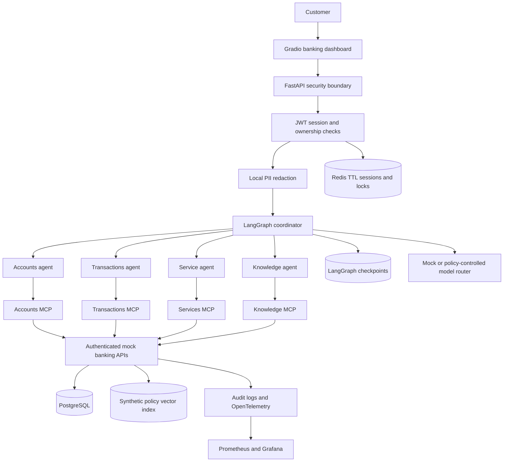

# SecureBank Agent

A working, synthetic banking assistant with a Gradio dashboard, FastAPI banking APIs, four authenticated MCP services, and LangGraph orchestration. It runs in deterministic mock mode without an API key.

**Development demonstration only.** All customers, accounts, transactions, policies and verification codes are synthetic. This application does not move money or connect to a real bank.

## Why it exists

The supplied business scenario estimates 4.2 lakh support calls per month, with roughly 65% covering repetitive questions. SecureBank demonstrates how conversational access can simplify balances, transaction queries and service requests while keeping authorization and sensitive actions under deterministic server control. Those call figures are planning assumptions, not measured outcomes of this implementation.

## Start locally

Python 3.12+ is required. Run from the repository root:

```bash
python3 -m venv venv
source venv/bin/activate
pip install -r requirements-dev.txt
python scripts/init_env.py
python agent.py
```

Open **http://127.0.0.1:8000/assistant**. The launcher applies migrations, seeds synthetic data, ingests policies, and starts the backend plus four MCP services.

If port 8000 is occupied:

```bash
PORT=8200 BANKING_API_URL=http://127.0.0.1:8200 python agent.py
```

Open **http://127.0.0.1:8200/assistant**. Do not run the old unauthenticated single-tool server; `server.py` now starts only the authenticated API, and `agent.py` starts the full application.

### Demo login

| Username | Role | Accounts |
|---|---|---|
| `demo01` | Standard customer | Two |
| `demo02` | Premium customer | Two |
| `demo03` | Privileged customer | Two |
| `demo04`–`demo10` | Alternating customer memberships | One or two |
| `demo11` | Support employee | No customer access |
| `demo12` | Administrator | No customer access |

Password for these synthetic fixtures: **`SyntheticDemo!42`**. The separate development OTP is **`654321`**. Select an account before asking an account-specific question if the customer owns multiple accounts.

Your existing `.env` is preserved. Mock mode does not use `OPENAI_API_KEY`. The setup script adds missing signing/database/dashboard secrets without printing or replacing existing keys.

## What works

- Development OAuth2/JWT login, refresh rotation and logout.
- Owned account selection, current/available balance and recent transactions.
- Transaction search and details, CSV statements with authenticated expiring downloads.
- Checkbook proposals with masked registered address; credit-limit and dispute proposals.
- Explicit confirmation, separate OTP verification, cancellation and idempotent submission.
- Customer-owned service-request status.
- Multi-intent routing with parallel independent reads.
- Local policy retrieval with document/version/section citations and an unknown-answer fallback.
- Sanitized memory, durable LangGraph interrupts, safe errors, audit records, tracing and metrics.
- Gradio streaming chat, transaction table, suggested actions, confirmation and OTP panels.
- Security regressions, a 104-scenario golden corpus, container configuration and CI gates.

The UI offers safe progress labels, not hidden reasoning or raw tool arguments. Account-specific answers are generated from successful, validated tool output. A failed balance lookup cannot become an invented balance.

## Architecture



Each specialist has a fixed tool allowlist. MCP arguments contain no caller-supplied customer identity or role. The coordinator does not query banking tables. See [ARCHITECTURE.md](ARCHITECTURE.md) for the runtime and trust boundaries.

## Example conversations

**Combined read**

> Show my balance and my last five transactions.

The coordinator calls the Accounts and Transactions Agents independently, then formats the validated results in INR.

**Checkbook**

> Request a checkbook.

Review the masked account and registered delivery address. Click **Confirm proposal**, enter the public synthetic code in the separate OTP field, then click **Verify and submit**. A successful response contains one `SR-...` reference. Entering “yes” in ordinary chat cannot submit the request.

**Other requests**

- `Search transactions for Grocery`
- `Explain transaction 1`
- `Generate my statement from 2026-08-01 to 2026-08-31`
- `Report suspicious transaction 1`
- `Increase my credit limit to 50,000`
- `Check service request status SR-...`
- `Explain bank charges`

Transaction positions refer to the most recent five transactions for the selected account. Requests without enough detail receive a clarification.

## Model configuration

Default configuration:

```dotenv
MODEL_PROVIDER=mock
LOCAL_MODEL_PROVIDER=ollama
LOCAL_MODEL_NAME=llama3.2
EXTERNAL_MODEL_PROVIDER=
EXTERNAL_MODEL_NAME=
ALLOW_EXTERNAL_LLM=false
```

For local Ollama, install/pull the chosen model separately and set `MODEL_PROVIDER=ollama`. The included adapters accept `openai`, `azure`, `anthropic`, and `bedrock` as provider names. Configure the appropriate SDK credentials and `EXTERNAL_MODEL_NAME`, then explicitly enable `ALLOW_EXTERNAL_LLM=true` if permitted. Sensitive detected input remains local. The adapters perform intent classification; banking answers remain deterministic.

The model never decides permissions, customer identity, OTP validity, balances or action references. External provider calls were not required for the tested mock workflow. Prices are deployment configuration, not hardcoded claims: set `MODEL_INPUT_USD_PER_MILLION` and `MODEL_OUTPUT_USD_PER_MILLION` to enable cost estimates.

## Database, memory and RAG

SQLAlchemy/Alembic define customers, users, roles, permissions, account ownership, cards, 300 seeded transactions, service requests, OTP challenges, sessions, chat messages, checkpoint snapshots, tool/security audits, model usage and evaluation records. PostgreSQL is used in Compose; SQLite supports a lightweight local run.

LangGraph uses durable checkpoints for confirmation pauses. Redis supports expiring session metadata, rate limits and locks; the local fallback supports one process. Messages are sanitized before persistence. Only a short recent window plus a compact summary is used. Explicitly approved language/channel preferences have a dedicated API. Run `python scripts/retention.py` hourly to purge expired conversation/checkpoint/download state.

Eight synthetic policy documents include identity, version, effective date and access metadata. Ingestion cleans paragraphs and uses offline hashed lexical embeddings with cosine retrieval. No account data enters the vector index. Citations accompany retrieved policy text. This offline implementation is intentionally lightweight; semantic multilingual retrieval needs further evaluation.

## Docker Compose

```bash
python scripts/init_env.py
docker compose up --build -d --wait
```

UI: **http://127.0.0.1:8200/assistant**. Grafana: **http://127.0.0.1:3000**, username `admin`, password stored as `GRAFANA_PASSWORD` in your local `.env`.

The stack contains backend/Gradio, four MCP services, PostgreSQL, Redis, Prometheus and Grafana. Database, Redis and MCP ports are not published. Persistent volumes retain the database and encrypted UI session key. Restart policies and health checks are configured. To stop: `docker compose down`. Omit `-v` to keep data.

The Compose images built successfully and the PostgreSQL/Redis stack passed the full banking smoke test. Set `PORT` and `GRAFANA_PORT` if the default host ports are occupied. CI repeats the Compose build and smoke test.

## Validation

```bash
make check
python scripts/secret_scan.py
python -m playwright install chromium
BANKING_API_URL=http://127.0.0.1:8200 python scripts/browser_smoke.py
# With all services running (adjust URL if using port 8200):
BANKING_API_URL=http://127.0.0.1:8200 python scripts/smoke.py
```

The suite covers auth/ownership, write confirmation, OTP expiration/lockout, concurrent idempotency, safe failures, PII, injection attempts and Gradio session configuration. Evaluation reports are written to `evaluations/reports/`. See [EVALUATION.md](EVALUATION.md) for exactly what is measured and what is not.

GitHub Actions runs lint, types, tests, evaluation, dependency auditing, tracked-source secret scanning, and a container smoke test. No deployment is automatically performed.

## Observability and operations

`/health` checks process health; `/ready` checks database/Redis. `/metrics` exposes request counts/latency, agent/MCP latency, security failures, tool failures, task completion, model usage and configured cost estimates. Grafana provisioning includes an operations dashboard. Set `OTEL_EXPORTER_OTLP_ENDPOINT` for a collector accepting OTLP HTTP; only operational metadata is recorded, not raw customer prompts or secrets.

Use [API.md](API.md) and the live `/docs` endpoint for request formats. [SECURITY.md](SECURITY.md) documents the development-only login/OTP and remaining operational limits. [infrastructure/AWS.md](infrastructure/AWS.md) describes Cognito, private ECS/EKS services, Bedrock, RDS, ElastiCache, KMS, Secrets Manager, CloudWatch and backup controls.

## Next production work

Replace demo identity/OTP with verified providers, perform a security review, expand browser coverage beyond the tested Chromium desktop/mobile layouts, exercise the PostgreSQL/Redis stack under load and failure, evaluate external models independently, and establish managed key rotation and backup restoration. Do not connect real financial systems based only on this demonstration's passing tests.

Technical references: [LangGraph persistence and interrupts](https://docs.langchain.com/oss/python/langgraph/interrupts), [Gradio mounting](https://gradio.app/docs/gradio/mount_gradio_app), [FastAPI OAuth2/JWT](https://fastapi.tiangolo.com/tutorial/security/oauth2-jwt/).
